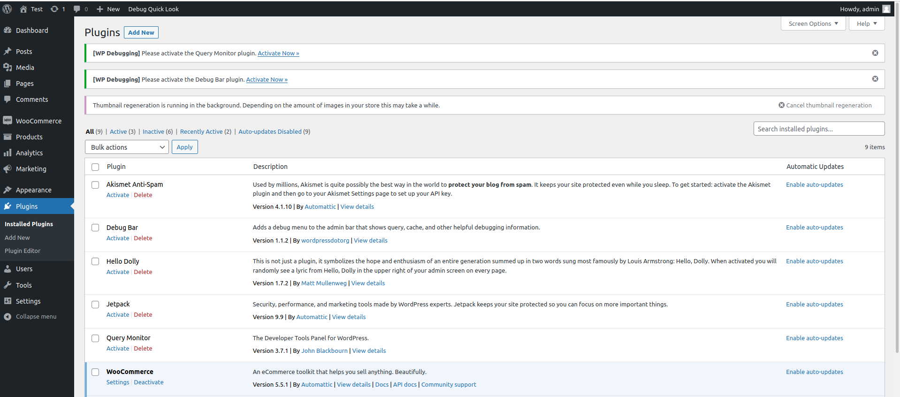
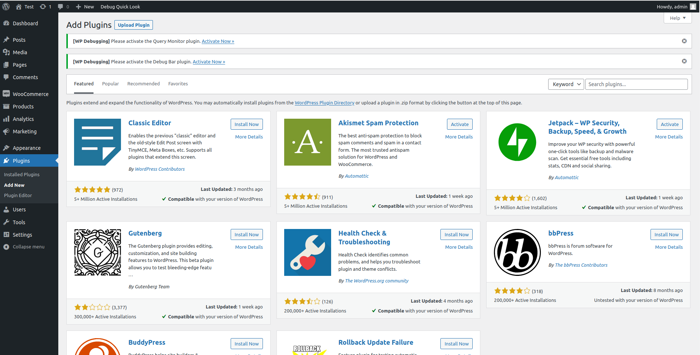
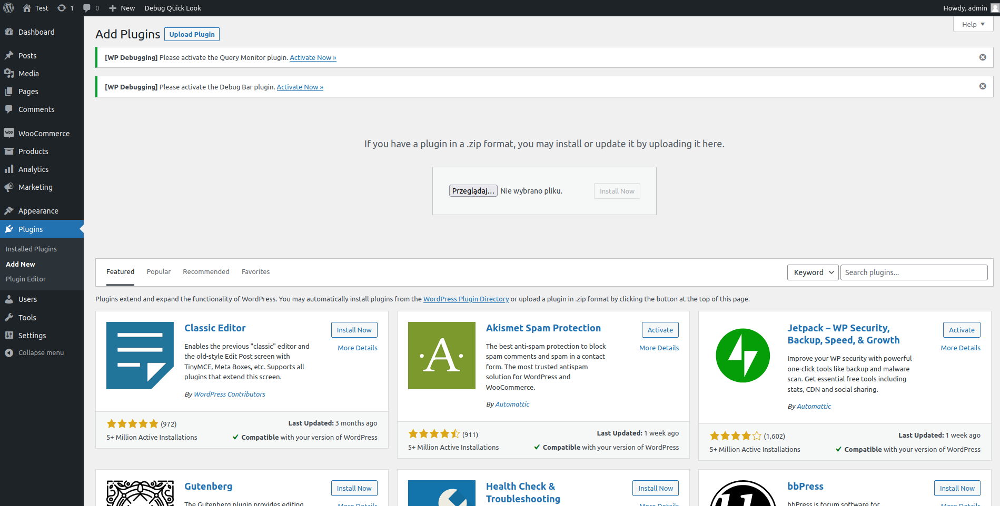
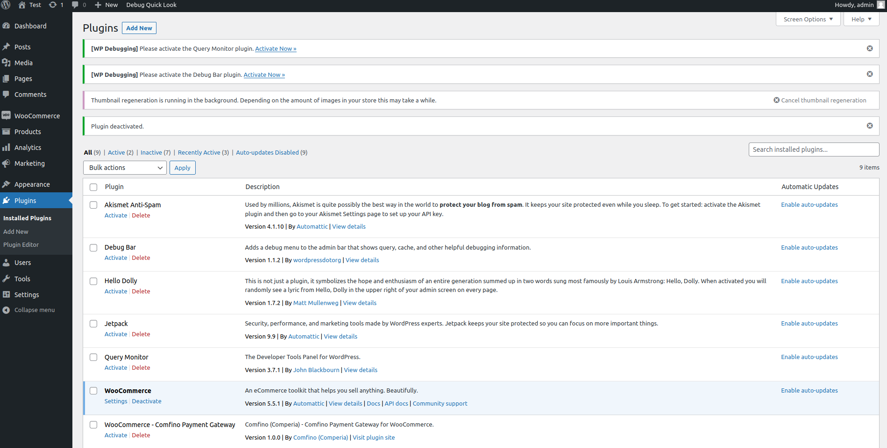
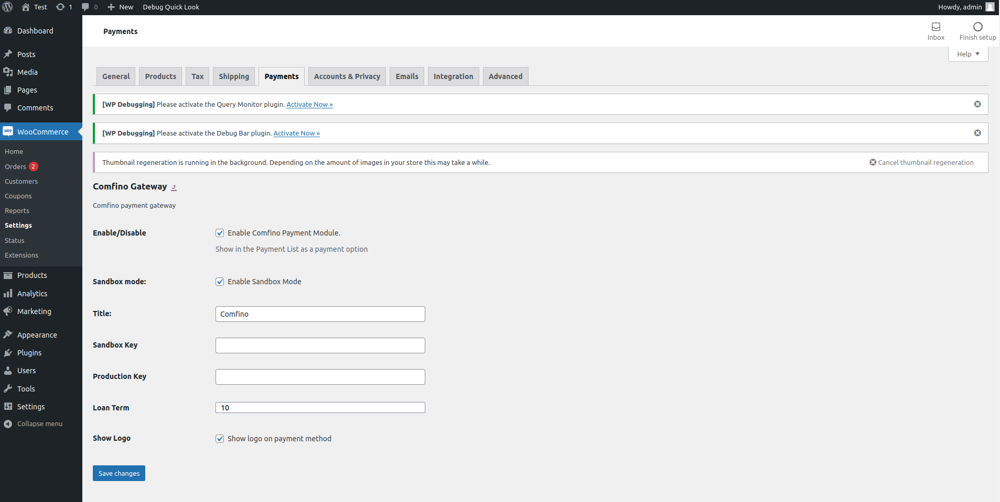

## DOWNLOAD PLUGIN

Open page https://github.com/comfino/WooCommerce/releases and download latest plugin

## INSTALATION

To install the module, please go to `"Plugins"` tab and then click `"Add new -> Upload plugin"` button, then panel with `"Module file"` input should appear. In this input choose module's file and click `"Send module button"`. If the module was uploaded, then it should be visible on modules list. Then you should just choose the module and click `"Install"` button.

## CONFIGURATION

For the module correct work, activation and configuration is required. You can do this by click `"Settings"` in module information panel. There are couple of important field that should be filled: `"Sandbox/Production Key"`.

* Title - this is text that will be showing near by payment option. Default value is `"Comfino"`

## ATTENTION

* For the module correct work, phone number field in checkout must be set required.
* HTTP's PUT Method should be enabled on the server.
* Required data in the Comfino plugin:
    * Customer:
        * first name - 2-63 characters
        * last name - 2-63 characters
        * email address - valid email address
        * valid polish mobile phone number (expected format: xxxxxxxxx, xxx xxx xxx, +48 xxxxxxxxx).
    * Card:
        * total amount
        * list of products
            * name
            * quantity
            * price
    * Address:
        * street
        * building number
        * apartment number
        * postal code
        * city
        * country code

## STATUS NOTIFICATIONS:

Change order status to complete. The result is invoice and shipment products.

* ACCEPTED
* WAITING_FOR_PAIMENT
* PAID

## FLOW

