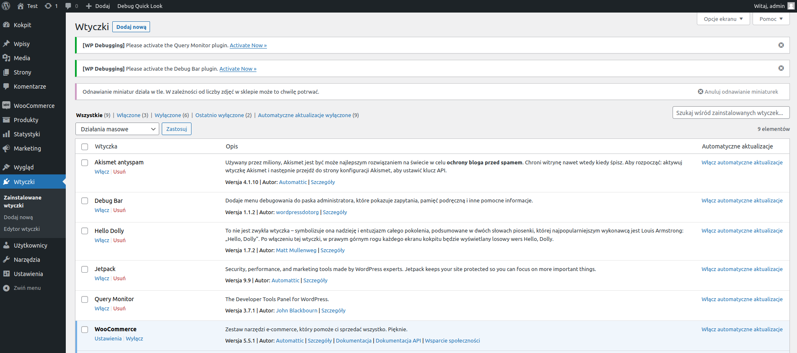
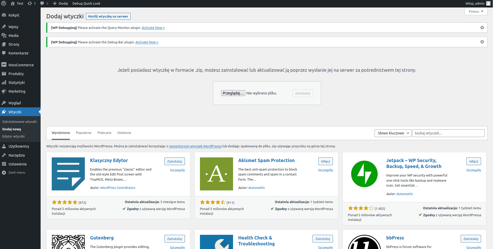
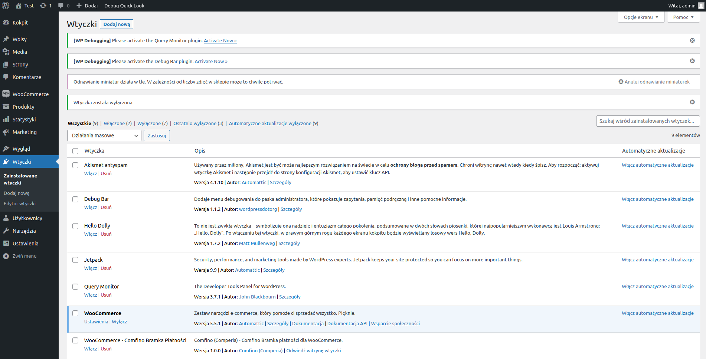
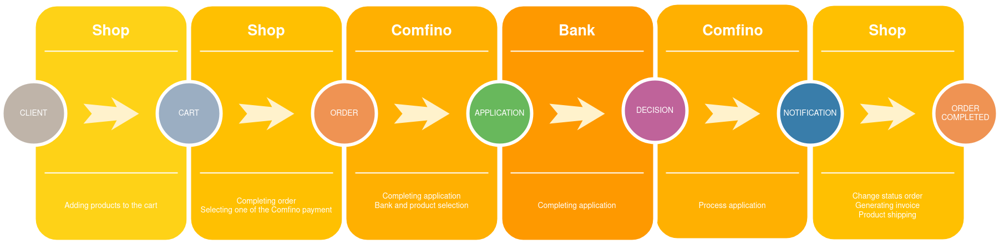

## POBIERANIE WTYCZKI

Otwórz stronę https://github.com/comfino/WooCommerce/releases i pobierz najnowszą wersję wtyczki.

## INSTALACJA

Aby zainstalować moduł, należy przejść do zakładki `"Wtyczki"` a następnie nacisnąć przycisk `"Dodaj nową -> Wyślij wtyczkę na serwer"`. Należy wybrać odpowiedni plik z modułem. Wtyczka zainstaluje się automatycznie.

## KONFIGURACJA

Aby moduł mógł działać, konieczne jest aktywowanie i skonfigurowanie go. Pole, które są najbardziej istotne i należy je wypełnić to: `"Sandbox/Production Key"`. 
Kolejnymi polami wartymi uwagi są:

* Tytył - pole odpowiada za tekst wyświetlany przy płatności. Domyślnie `"Comfino"`

## UWAGI

* Aby moduł mógł działać poprawnie, należy ustawić numer telefonu dla użytkownika w koszyku jako wymagany. 
* Metoda http "PUT" musi być aktywna.
* Wymagane dane w pluginie Comfino:
    * Klient:
        * imię - 2-63 znaków
        * nazwisko - 2-63 znaków
        * email - poprawny adres email
        * poprawny polski numer komórkowy (oczekiwany format: xxxxxxxxx, xxx xxx xxx, +48 xxxxxxxxx).
    * Koszyk:
        * kwota koszyka
        * lista produktów
            * nazwa
            * ilość
            * cena
    * Adres:
        * ulica
        * numer budynku
        * numer mieszkania
        * kod pocztowy
        * miasto
        * kod kraju

## STATUSY NOTYFIKACJI:

Zmieniają status zamówienia na kompletny. Wynikiem jest faktura i wysyłka towaru.

* ACCEPTED
* WAITING_FOR_PAIMENT
* PAID

## FLOW

