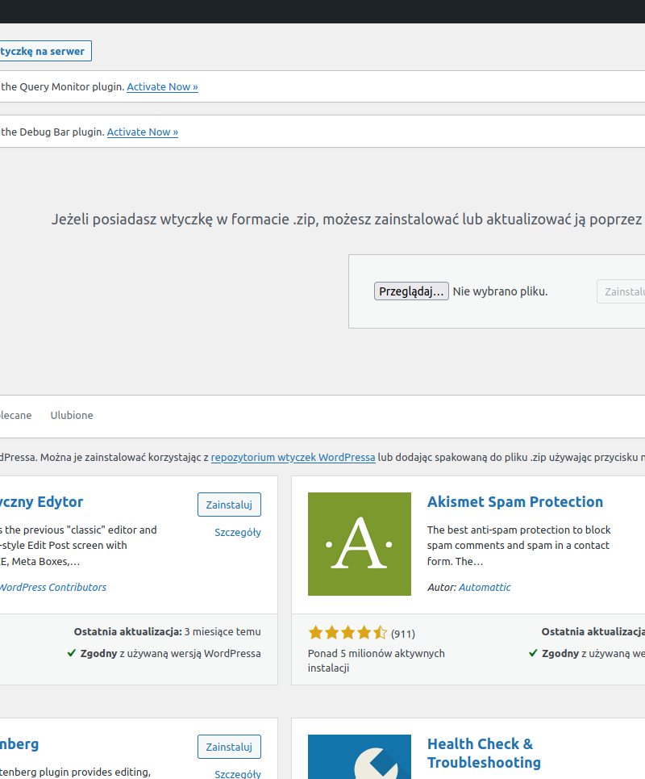
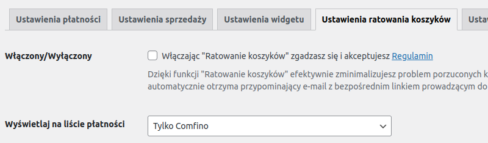

## POBIERANIE WTYCZKI

Pobierz najnowszą wersję wtyczki ze strony: https://github.com/comfino/WooCommerce/releases

## INSTALACJA

Wersja on-line dokumentacji: https://comfino.pl/plugins/WooCommerce/pl

Przejdź do zakładki `"Wtyczki"`, następnie kliknij przycisk `"Dodaj nową -> Wyślij wtyczkę na serwer"`. Należy wybrać odpowiedni plik z modułem. Wtyczka zainstaluje się automatycznie.

## KONFIGURACJA
Parametry konfiguracyjne modułu są pogrupowane kategoriami odpowiadającymi zakładkom panelu konfiguracyjnego: `"USTAWIENIA PŁATNOŚCI"`, `"USTAWIENIA WIDGETU"`, `"USTAWIENIA DEWELOPERSKIE"`.
Ostatnia zakładka `"DIAGNOSTYKA WTYCZKI"` nie zawiera żadnych parametrów do ustawienia i pełni funkcję informacyjno-diagnostyczną. Zawiera między innymi lokalny dziennik błędów (log błędów).

Przed użyciem płatności Comfino, moduł musi zostać skonfigurowany. Możesz to zrobić, klikając `"Konfiguruj"` w panelu informacyjnym modułu.

Najważniejsze pole, które musi być uzupełnione, to pole `"Klucz API środowiska produkcyjnego"` z zakładki `"USTAWIENIA PŁATNOŚCI"`.
W zakładce `"USTAWIENIA DEWELOPERSKIE"` znajduje się pole drugiego klucza - `"Klucz API środowiska testowego"`.

Pola parametrów konfiguracyjnych:

**USTAWIENIA PŁATNOŚCI**

* **Klucz API środowiska produkcyjnego** — unikalny klucz dostępowy umożliwiający komunikację modułu z API Comfino (otrzymasz go od przedstawiciela Comfino)
* **Prezentacja płatności** — sposób prezentacji Comfino na liście metod płatności [`Tylko ikona`, `Tylko tekst`, `Ikona i tekst`]
* **Tekst płatności** — tekst wyświetlany na liście metod płatności (domyślnie `"(Raty | Kup Teraz, Zapłać Póżniej | Finansowanie dla Firm)"`)
* **Minimalna kwota w koszyku** — wartość koszyka, od której dostępna jest płatność Comfino (domyślnie: 30 zł)

**USTAWIENIA WIDGETU**

**Ustawienia podstawowe**

* **Widget włączony?** — przełącznik aktywacji/deaktywacji widgetu promocyjnego na stronie produktu
* **Typ widgetu** — sposób prezentacji widgetu [`Widget tekstowy`, `Widget graficzny z banerem`, `Widget graficzny z kalkulatorem rat`]
* **Typ oferty** — typ promowanej oferty finansowania [`Raty zero procent`, `Niskie raty`, `Zapłać później`]

**Ustawienia zaawansowane**

* **Selektor elementu ceny widgetu** — element dokumentu HTML zawierający cenę produktu
* **Selektor elementu zakotwiczenia widgetu** — element kontenera widgetu (w nim jest osadzany widget)
* **Wykrywanie zmian ceny - selektor kontenera** — element dokumentu HTML zawierający w sobie element ceny bezpośrednio lub pośrednio używany do śledzenia zmian cen i przeliczania ofert
* **Wykrywanie zmian ceny - poziom hierarchii kontenera** — poziom hierarchii DOM używany do śledzenia zmian cen i przeliczania ofert
* **Metoda osadzania** — sposób orientacji widgetu względem elementu kontenera [`INSERT_INTO_FIRST`, `INSERT_INTO_LAST`, `INSERT_BEFORE`, `INSERT_AFTER`]
* **Kod inicjalizacji widgetu** — skrypt JavaScript inicjalizujący widget na stronie produktu (wprowadzanie zmian niezalecane dla niezaawansowanych użytkowników bez znajomości JavaScript)

Szczegółowe informacje o działaniu widgetu i jego opcjach konfiguracyjnych znajdziesz w osobnej [dokumentacji widgetu Comfino](https://comfino.pl/widgets/comfino-prestashop/pl).

**USTAWIENIA DEWELOPERSKIE**

* **Użyj środowiska testowego** — przełącznik aktywacji/deaktywacji trybu deweloperskiego
* **Klucz API środowiska testowego** — unikalny klucz dostępowy umożliwiający komunikację modułu z testowym API Comfino

**Uwaga**

Przed uruchomieniem płatności na sklepie produkcyjnym, wyłącz tryb deweloperski, aby zablokować użycie środowiska testowego płatności Comfino.

**DIAGNOSTYKA WTYCZKI**

Zakładka zawiera informacje techniczne o wtyczce i środowisku (wersja wtyczki, wersja sklepu, wersja PHP i serwera www, itp.).\
Zawiera też listę ostatnich błędów wraz z podglądem lokalnego dziennika błędów (log błędów).

Informacja o aktywności trybu deweloperskiego jest wyświetlana w zakładkach `"USTAWIENIA PŁATNOŚCI"` i `"DIAGNOSTYKA WTYCZKI"`.
W trybie tym wtyczka używa klucza z zakładki `"USTAWIENIA DEWELOPERSKIE"` do komunikacji z testowym API Comfino. Klucz środowiska testowego również otrzymasz od przedstawiciela Comfino.

## UWAGI

* Moduł płatności Comfino wymaga ustawienia numeru telefonu klienta jako wymaganego w procesie wprowadzania danych kontaktowych klienta. Numer telefonu jest używany do przesyłania kodów i informowania klienta o statusie transakcji, na dalszym etapie procesowania płatności Comfino. W przypadku braku numeru telefonu transakcja płatnicza Comfino zakończy się błędem wyświetlonym na stronie sklepu.
* System notyfikacji modułu wymaga dostępności metody HTTP "PUT". Moduł otrzymuje informacje o zmianach statusu transakcji Comfino i stosownie zmienia wewnętrzny status zamówienia w PrestaShop. W przypadku problemów z notyfikacjami należy sprawdzić ustawienia serwera www w Twoim panelu hostingu.
* Dane klienta i zamówienia wymagane przez moduł Comfino:
    * Klient:
        * imię — 2-63 znaków
        * nazwisko — 2-63 znaków
        * e-mail — poprawny adres e-mail
        * telefon — poprawny polski numer komórkowy (oczekiwany format: xxxxxxxxx, xxx xxx xxx, +48 xxxxxxxxx).
    * Koszyk:
        * kwota koszyka
        * lista produktów
            * nazwa
            * ilość
            * cena
    * Adres:
        * ulica
        * numer budynku
        * numer mieszkania
        * kod pocztowy
        * miasto
        * kod kraju

## PRZYKŁADOWY WYGLĄD KOSZYKA Z LISTĄ METOD PŁATNOŚCI

## PRZEBIEG PROCESU COMFINO

